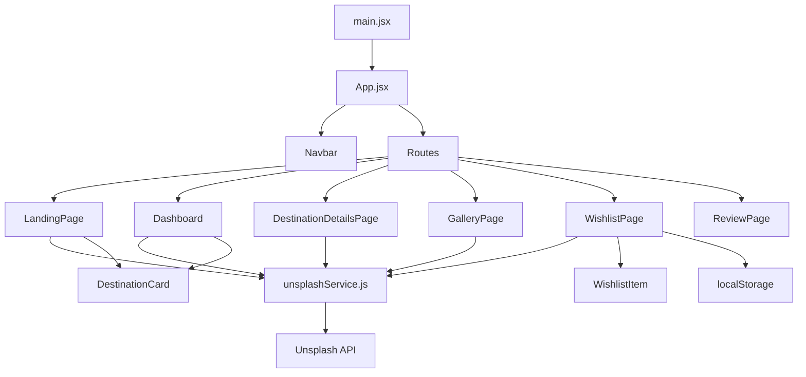

# Design Document: VoyageVerse — Vanilla to React Migration

## Overview

VoyageVerse is migrated from a multi-page vanilla JS/HTML/CSS application into a single-page React application (SPA) using Vite as the build tool and React Router v6 for client-side navigation. All Firebase authentication and Firestore backend services are removed. The app is entirely frontend: images come from the Unsplash API, wishlist data is persisted in `localStorage`, and the review form is purely client-side with no submission backend.

The migration preserves all existing visual styles and functionality. Each original HTML page becomes a React route/component, and shared UI (the Navbar) becomes a single reusable component rendered on every page.

---

## Architecture

The app follows a standard React SPA architecture:

```
Browser
  └── index.html (single entry point)
        └── React App (main.jsx)
              ├── BrowserRouter (React Router v6)
              │     └── App.jsx  (route definitions + Navbar)
              │           ├── /                → LandingPage
              │           ├── /dashboard       → Dashboard
              │           ├── /destinations    → DestinationDetailsPage
              │           ├── /gallery         → GalleryPage
              │           ├── /wishlist        → WishlistPage
              │           └── /review          → ReviewPage
              └── Shared Services
                    └── unsplashService.js
```



**Key architectural decisions:**

- **Vite + React**: Faster dev server and build than CRA; standard for new React projects.
- **React Router v6 `<BrowserRouter>`**: Declarative client-side routing; `<Link>` replaces `<a href>` for in-app navigation to avoid full reloads.
- **Shared `unsplashService`**: All Unsplash `fetch` calls are centralised in one module so the API key and base URL live in one place.
- **Tailwind CSS v3**: Utility classes are applied inline in JSX. No per-component CSS files are needed — scoping is handled naturally by component boundaries. `index.css` contains only the three Tailwind directives (`@tailwind base/components/utilities`) plus any minimal global resets. `tailwind.config.js` and `postcss.config.js` are added at the project root.
- **No state management library**: The app's state is simple and local to each page component; `useState` / `useEffect` are sufficient.

---

## Components and Interfaces

### File Structure

```
tailwind.config.js                   # Tailwind content paths + theme
postcss.config.js                    # autoprefixer + tailwindcss plugins
src/
├── main.jsx
├── App.jsx
├── index.css                        # @tailwind base/components/utilities + minimal global resets
├── assets/                          # static images, logo, favicon
│   ├── logo.png
│   ├── hero-bg.avif
│   ├── wishlist-bg.jpg
│   └── world-map.png
├── services/
│   └── unsplashService.js
├── data/
│   └── destinations.js              # predefined destination data
├── components/
│   ├── Navbar/
│   │   └── Navbar.jsx               # Tailwind utility classes inline
│   ├── DestinationCard/
│   │   └── DestinationCard.jsx      # Tailwind utility classes inline
│   └── WishlistItem/
│       └── WishlistItem.jsx         # Tailwind utility classes inline
└── pages/
    ├── LandingPage/
    │   └── LandingPage.jsx          # Tailwind utility classes inline
    ├── Dashboard/
    │   └── Dashboard.jsx            # Tailwind utility classes inline
    ├── DestinationDetailsPage/
    │   └── DestinationDetailsPage.jsx
    ├── GalleryPage/
    │   └── GalleryPage.jsx
    ├── WishlistPage/
    │   └── WishlistPage.jsx
    └── ReviewPage/
        └── ReviewPage.jsx
```

**Tailwind configuration:**

```js
// tailwind.config.js
export default {
  content: ['./index.html', './src/**/*.{js,jsx}'],
  theme: { extend: {} },
  plugins: [],
}
```

```js
// postcss.config.js
export default {
  plugins: { tailwindcss: {}, autoprefixer: {} },
}
```

```css
/* src/index.css */
@tailwind base;
@tailwind components;
@tailwind utilities;

/* minimal global resets only — no component-level styles */
```

### Component Interfaces

#### `Navbar`
```jsx
// No props — reads route state from React Router internally
<Navbar />
```
Renders the fixed header with logo and `<Link>` elements for all routes.

#### `DestinationCard`
```jsx
<DestinationCard destination={string} imgUrl={string} />
```
Displays a card with a cover image and destination name overlay.

#### `WishlistItem`
```jsx
<WishlistItem
  destination={string}
  imgUrl={string}
  onDelete={(destination: string) => void}
/>
```
Displays a saved wishlist card with a delete button. Calls `onDelete` when the trash icon is clicked.

#### `LandingPage` / `Dashboard`
No props. Both manage their own `cards` state (array of `{destination, imgUrl}`) via `useState` and drive a `setInterval` refresh every 10 s via `useEffect`.

#### `DestinationDetailsPage`
No props. Manages `query` (search input), `currentDestination` (string), `imgUrl` (string), and `details` (object from `destinations.js`) via `useState`.

#### `GalleryPage`
No props. Fetches all gallery categories on mount and stores results in `cards` state.

#### `WishlistPage`
No props. Manages `query` (search input) and `items` (array of `{destination, imgUrl}` loaded from `localStorage`) via `useState`.

#### `ReviewPage`
No props. Manages `destination` (string), `review` (string), `error` (string | null), and `success` (boolean) via `useState`.

---

## Data Models

### Unsplash API Response (relevant fields)
```ts
interface UnsplashSearchResult {
  results: Array<{
    urls: {
      regular: string;
    };
  }>;
}
```

### DestinationCard data
```ts
interface CardData {
  destination: string;  // display name, e.g. "Paris"
  imgUrl: string;       // Unsplash regular image URL
}
```

### WishlistItem (localStorage)
Each wishlist entry is stored as a key-value pair in `localStorage`:
```
key:   destination name (string)
value: JSON-stringified image URL (string)
```
Example: `localStorage.setItem("Paris", JSON.stringify("https://images.unsplash.com/..."))`

On load, `WishlistPage` iterates `localStorage` keys and reconstructs `CardData[]`.

### Predefined Destination Data (`src/data/destinations.js`)
```ts
interface DestinationDetails {
  about: string;
  attractions: string[];
  weather: string;
}

const destinations: Record<string, DestinationDetails> = {
  Italy: { about: "...", attractions: [...], weather: "..." },
  Paris: { ... },
  Spain: { ... },
  Australia: { ... },
  India: { ... },
  Egypt: { ... },
  Japan: { ... },
};
```

### Gallery Categories (`src/data/destinations.js` or inline)
```ts
const galleryCategories: string[] = [
  "Snowy Escapes", "Secluded Shores", "Sunset Lover", "Adventure Junkies",
  "Majestic Mountains", "Tropical Escapes", "Temples and Traditions",
  "City Lights", "Wild Encounters", "Water Adventures", "Starry Nights",
  "Spring Blooms", "Offbeat Trails", "Wander Alone", "Romantic Getaways",
  "Autumn Trails"
];
```

### Places List (Landing Page / Dashboard)
```ts
const places: string[] = [
  "Paris", "New York", "Italy", "Australia", "India", "Egypt", "Japan",
  "Canada", "Brazil", "South Africa", "Thailand", "Spain", "Germany",
  "Russia", "Mexico", "Turkey", "Greece", "Switzerland", "Netherlands",
  "Sweden", "Norway", "Finland", "Denmark", "Portugal", "Ireland",
  "Belgium", "Austria", "Poland", "Czech Republic", "Hungary", "Croatia"
];
```

### `unsplashService.js` API
```ts
// Fetch a single image URL for a query keyword
fetchImage(query: string): Promise<string | null>

// Fetch images for multiple destinations in parallel
fetchImages(destinations: string[]): Promise<CardData[]>

// Pick 7 unique random destinations from the places list
chooseDestinations(): string[]
```

### Review Form State
```ts
interface ReviewFormState {
  destination: string;
  review: string;
  error: string | null;
  success: boolean;
}
```

---

## Correctness Properties

*A property is a characteristic or behavior that should hold true across all valid executions of a system — essentially, a formal statement about what the system should do. Properties serve as the bridge between human-readable specifications and machine-verifiable correctness guarantees.*

### Property 1: Destination card fetch count on mount

*For any* page that fetches destination cards on mount (LandingPage, Dashboard), when all Unsplash API calls succeed, exactly 7 `DestinationCard` components should be rendered.

**Validates: Requirements 3.4, 4.5**

---

### Property 2: Destination card refresh on interval

*For any* page that auto-refreshes destination cards (LandingPage, Dashboard), after 10 seconds have elapsed, the rendered set of destination cards should be replaced with a new set of 7 cards.

**Validates: Requirements 3.5, 4.6**

---

### Property 3: Error resilience — failed image fetches are skipped

*For any* page that fetches images from Unsplash (LandingPage, Dashboard, GalleryPage), if N out of M fetch calls fail, the page should render exactly M − N cards without throwing an error or rendering broken cards.

**Validates: Requirements 3.6, 4.7, 6.4**

---

### Property 4: SPA navigation does not cause full page reload

*For any* navigation link in the Navbar, clicking it should update the browser URL and render the corresponding page component without triggering a full browser reload (i.e., the React root is never unmounted and remounted).

**Validates: Requirements 2.3**

---

### Property 5: Destination details completeness

*For any* destination key in the predefined destinations data object, the rendered `DestinationDetailsPage` should display the destination name, "Explore [destination]!" tagline, about text, at least one attraction, and weather text.

**Validates: Requirements 5.5, 5.7**

---

### Property 6: Destination search updates displayed details

*For any* destination name that exists in the predefined destinations data, submitting it via the search bar should update all displayed detail fields (name, tagline, about, attractions, weather) to match that destination's data.

**Validates: Requirements 5.3**

---

### Property 7: Gallery cards display category name as caption

*For any* successfully fetched gallery image, the rendered card should contain both an `` element with the image URL and a caption element whose text matches the category name used to fetch it.

**Validates: Requirements 6.2**

---

### Property 8: Wishlist localStorage round trip

*For any* non-empty destination name where the Unsplash API returns an image URL, adding it to the wishlist should result in: (a) the destination name and image URL being persisted in `localStorage`, and (b) a `WishlistItem` card for that destination being visible in the rendered list. Conversely, loading the `WishlistPage` with pre-populated `localStorage` should render a card for every stored entry.

**Validates: Requirements 7.1, 7.4**

---

### Property 9: Wishlist item deletion removes from localStorage and UI

*For any* `WishlistItem` currently displayed on the `WishlistPage`, clicking its delete button should remove the corresponding key from `localStorage` and remove the card from the rendered list, leaving all other items unchanged.

**Validates: Requirements 7.5**

---

### Property 10: Search input cleared after successful wishlist add

*For any* successful wishlist search (Unsplash returns an image), the search input field should be empty after the card is added.

**Validates: Requirements 7.6**

---

### Property 11: Review form valid submission resets state

*For any* form submission where both the destination field and the review textarea are non-empty, the `ReviewPage` should display a success message and reset both fields to empty strings.

**Validates: Requirements 8.2**

---

### Property 12: Review form invalid submission shows validation message

*For any* form submission where at least one of the destination field or review textarea is empty (or whitespace-only), the `ReviewPage` should display a validation error message and not reset the form.

**Validates: Requirements 8.3**

---

## Error Handling

| Scenario | Handling |
|---|---|
| Unsplash API returns non-OK HTTP status | `unsplashService.fetchImage` returns `null`; callers skip the card |
| Unsplash API returns empty `results` array | `imgUrl` is `undefined`; callers skip the card |
| Network failure during Unsplash fetch | `try/catch` in `unsplashService`; returns `null` for that destination |
| Search for unknown destination on DestinationDetailsPage | `alert()` shown; displayed details remain unchanged |
| Empty search term on DestinationDetailsPage | `alert()` shown; no API call made |
| Empty search term on WishlistPage | No API call made; input remains focused |
| Unsplash returns no image for wishlist search | Console log; no card added; input cleared |
| Review form submitted with missing fields | Inline validation message shown; form not reset |
| `localStorage` unavailable (private browsing) | Wishlist operations fail gracefully with a console error; no crash |

---

## Testing Strategy

### Dual Testing Approach

Both unit tests and property-based tests are used. They are complementary:
- **Unit tests** verify specific examples, integration points, and edge cases.
- **Property-based tests** verify universal properties across many randomly generated inputs.

### Unit Tests (Vitest + React Testing Library)

Focus areas:
- Navbar renders logo and all navigation links (Requirement 2.1, 2.2)
- LandingPage renders hero section and tagline (Requirement 3.1, 3.2)
- Dashboard renders hero, wishlist button, and description links (Requirement 4.1, 4.3)
- DestinationDetailsPage shows Italy on mount (Requirement 5.1)
- DestinationDetailsPage shows alert on empty search (Requirement 5.4)
- DestinationDetailsPage shows alert for unknown destination (Requirement 5.6)
- GalleryPage renders heading "Gallery" (Requirement 6.3)
- GalleryPage categories list has exactly 16 entries (Requirement 6.5)
- WishlistPage renders search bar and button (Requirement 7.2)
- WishlistPage does not add card when Unsplash returns no image (Requirement 7.7)
- ReviewPage renders destination input and review textarea (Requirement 8.1)
- Clicking "Create Your Own Wishlist" navigates to /wishlist (Requirement 4.2)
- SPA navigation via Navbar links (Requirement 1.2)
- Background images are applied to the correct pages via Tailwind `bg-[url(...)]` or inline style (Requirement 9.3)

### Property-Based Tests (fast-check)

Library: **fast-check** (JavaScript/TypeScript PBT library).
Each property test runs a minimum of **100 iterations**.
Each test is tagged with a comment in the format:
`// Feature: vanilla-to-react-migration, Property N: <property_text>`

| Property | Test Description |
|---|---|
| Property 1 | Generate a mock Unsplash service returning success for 7 destinations; assert card count === 7 |
| Property 2 | Use fake timers; advance by 10 000 ms; assert cards are replaced |
| Property 3 | Generate random N failures out of 7 fetches; assert rendered card count === 7 − N |
| Property 4 | Generate random route paths; assert URL changes without full reload |
| Property 5 | For each of the 7 predefined destinations, assert all detail fields render |
| Property 6 | Generate random valid destination names from the predefined set; assert details update |
| Property 7 | Generate random category names and image URLs; assert card contains both |
| Property 8 | Generate random destination names and URLs; save to localStorage; mount page; assert cards match |
| Property 9 | Populate localStorage with N items; delete one; assert N−1 items remain in both localStorage and UI |
| Property 10 | Generate random valid destination names; assert input is empty after add |
| Property 11 | Generate random non-empty destination and review strings; assert success message shown and fields cleared |
| Property 12 | Generate form states with at least one empty field; assert validation message shown |

### Test Configuration

```js
// vitest.config.js
export default {
  test: {
    environment: 'jsdom',
    globals: true,
    setupFiles: './src/test/setup.js',
  }
}
```

```js
// fast-check property test example
import fc from 'fast-check';

test('Property 11: valid review submission resets form', () => {
  // Feature: vanilla-to-react-migration, Property 11: valid submission resets state
  fc.assert(
    fc.property(
      fc.string({ minLength: 1 }),
      fc.string({ minLength: 1 }),
      (destination, review) => {
        // render ReviewPage, fill fields, submit, assert success + reset
      }
    ),
    { numRuns: 100 }
  );
});
```
